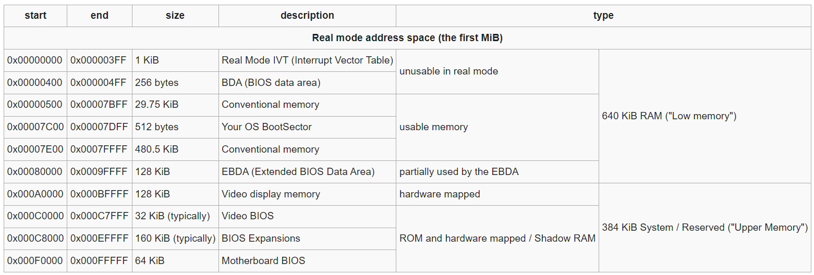

- [BOIS](#bois)
- [ACPI](#acpi)
  - [RSDP (Root System Description Pointer)](#rsdp-root-system-description-pointer)
  - [ACPI System Description Tables](#acpi-system-description-tables)
    - [Generic Address Structure](#generic-address-structure)
    - [System Description Table Header](#system-description-table-header)
    - [RSDT/XSDT](#rsdtxsdt)
-----
# BOIS
BIOS物理内存使用情况



# ACPI
Advanced Configuration and Power Interface
## RSDP (Root System Description Pointer)
OSPM finds the Root System Description Pointer (RSDP) structure by searching physical memory ranges on 16-byte
boundaries for a valid Root System Description Pointer structure signature and checksum match as follows:
- The first 1 KB of the Extended BIOS Data Area (EBDA). For EISA or MCA systems, the EBDA can be found
in the two-byte location 40:0Eh on the BIOS data area.
- The BIOS read-only memory space between 0E0000h and 0FFFFFh.

| **Field**          | **Byte Length** | **Byte Offset** |
| ------------------ | --------------- | --------------- |
| Signature          | 8               | 0               |
| Checksum           | 1               | 8               |
| OEMID              | 6               | 9               |
| Revision           | 1               | 15              |
| RsdtAddress        | 4               | 16              |
| Length*            | 4               | 20              |
| XsdtAddress*       | 8               | 24              |
| Extended Checksum* | 1               | 32              |
| Reserved*          | 3               | 33              |

- **Signature**：`"RSD PTR "`（签名必须包括后面的空格字符）
- **Checksum**：此字段为校验和，用于校验ACPI 1.0规范中定义的字段。只包含表的前20个字节（0-19字节），这些字节加上校验字段的总和必须为0。
- **OEMID**：OEM提供的字符串，用于标识OEM厂商。
- **Revision**：结构的版本号。更高的版本号与较低的版本号兼容。ACPI 1.0的版本号为0，ACPI 1.0的RSDP结构只包含前20个字节（0-19字节），不包括Length字段及后面的内容。当前版本值为2。
- **RsdtAddress**：RSDT的32位物理地址。
- **Length***：表的长度，以字节为单位，从偏移量0开始计算，包括头部。该字段在ACPI 1.0 RSDP结构中不可用。
- **XsdtAddress***：XSDT的64位物理地址。
- **Extended Checksum***：整个表的校验和，包括两个校验和字段。
- **Reserved***：保留字段。

> 注：带 `*` 标记的字段在ACPI 1.0 RSDP结构中不可用。
```c
struct RSDP_t {
 char Signature[8];
 uint8_t Checksum;
 char OEMID[6];
 uint8_t Revision;
 uint32_t RsdtAddress;
 //2.0
 uint32_t Length;
 uint64_t XsdtAddress;
 uint8_t ExtendedChecksum;
 uint8_t reserved[3];
} __attribute__ ((packed));
```


## ACPI System Description Tables

### Generic Address Structure
通用地址结构 (GAS) 为平台提供了一种描述寄存器位置的可靠方法。此结构(如下所述)用于在 ACPI 定义的表中表达寄存器地址或者特殊数据结构地址。
| **Field**          | **Byte Length** | **Byte Offset** |
| ------------------ | --------------- | --------------- |
| Address Space ID   | 1               | 0               |
| Register Bit Width | 1               | 1               |
| Register BitOffset | 1               | 2               |
| Access Size        | 1               | 3               |
| Address            | 8               | 4               |
- **Address Space ID**： 数据结构或寄存器所在的地址空间。定义值如下：
  - 0x00 System Memory space
  - 0x01 System I/O space
  - 0x02 PCI Configuration space
  - 0x03 Embedded Controller
  - 0x04 SMBus
  - 0x05 SystemCMOS
  - 0x06 PciBarTarget
  - 0x07 IPMI
  - 0x08 General PurposeIO
  - 0x09 GenericSerialBus
  - 0x0A Platform Communications Channel (PCC)
  - 0x0B to 0x7E Reserved
  - 0x7F Functional Fixed Hardware
  - 0x80 to 0xBF Reserved
  - 0xC0 to 0xFF OEM Defined
- **Register Bit Width**： 给定寄存器的总宽度(以位bit为单位)。例如，若寄存器是一个 32 位宽的寄存器，则该值应为 32。它指的是整个寄存器的宽度，而不仅仅是某个特定字段的宽度。
- **Register BitOffset**： 给定寄存器相对 `Adress` 字段的偏移量(以位bit为单位)。
- **Access Size**： 指定访问大小。除非 `Address Space ID` 字段另有定义, 否则如下
  - 0 Undefined (legacy reasons)
  - 1 Byte access
  - 2 Word access
  - 3 Dword access
  - 4 QWord access
- **Adress**： 给定地址空间中数据结构或寄存器的 64 位地址（相对于处理器）。一般来说地址的格式由 `Address Space ID` 指定，如下：

  - **0 - System Memory**
     - 这是指系统内存空间中的地址，即寄存器的物理地址。在 64 位平台下可以访问完整的 64 位地址，但在 32 位平台下，高 DWORD 必须为 0，表示只能使用 32 位的地址。
     - **解释**：32 位平台无法处理大于 4 GB 的物理地址，所以必须设置高 32 位（高 DWORD）为 0。
  - **1 - System I/O**
     - 表示系统 I/O 地址空间中的地址。与系统内存类似，32 位平台下高 DWORD 必须为 0。
     - **解释**：I/O 地址用于访问外部设备，I/O 地址空间也有类似的限制，即 32 位平台只能使用 32 位的地址。
  - **2 - PCI Configuration Space**
     - 表示 PCI 配置空间的地址，仅限于 PCI Segment Group 0 上的设备。该限制存在的原因是为了能够在 PCI 总线枚举之前访问固定硬件。
     - **解释**：PCI 配置空间的地址主要用于访问 PCI 设备的配置寄存器。这里的段号、设备号、功能号和偏移量用于精确定位 PCI 设备上的特定寄存器。
  - **6 - PCI BAR Target**
     - 用于定位 PCI 设备的 MMIO（Memory-Mapped I/O）寄存器，地址格式中包含段号、总线号、设备号、功能号、BAR 索引和偏移量。
     - **解释**：此字段用于访问 PCI 设备上的 BAR 区域，该区域用于映射设备的内存资源。地址格式复杂，需要分多个部分来精确定位设备。
  - **0x0A - PCC**
     - 未定义，暂时没有详细的解释或定义。
  - **0x7F - Functional Fixed Hardware**
     - 功能固定硬件的使用需要 CPU 制造商提供具体定义，依赖于特定的操作系统支持。
     - **解释**：这些固定的硬件寄存器可能与特定 CPU 架构相关。硬件设计时，通常会与操作系统供应商合作，以确保硬件与软件之间的兼容性。
### System Description Table Header

所有的ACPI系统描述表都以如下结构体`DESCRIPTION_HEADER` 开头，表中的 `Signature` 字段决定了描述表的内容。
| **Field**        | **Byte Length** | **Byte Offset** |
| ---------------- | --------------- | --------------- |
| Signature        | 4               | 0               |
| Length           | 4               | 4               |
| Revision         | 1               | 8               |
| Checksum         | 1               | 9               |
| OEMID            | 6               | 10              |
| OEM Table ID     | 8               | 16              |
| OEM Revision     | 4               | 24              |
| Creator ID       | 4               | 28              |
| Creator Revision | 4               | 32              |

- **Signature**: ASCII 字符串标识的签名。如果 OSPM 在表 5.5 中表中发现未列出的签名，则 OSPM 会忽略整个表（不会将其加载到 ACPI 命名空间中）；即使长度和校验和字段中的值正确，OSPM 也会忽略该表。
- **Length**: 表的长度，以字节为单位，包括表头。
- **Revision**: 与该表对应的结构体版本号，新的的版本号会向旧的兼容
- **Checksum**: 检验字段，整个表包括`Checksum`按`Byte`(8位)相加最后都等于零
- **OEMID**: OEM-supplied string identifying the OEM.
- **OEM Table ID**: Identifies the particular data table.
- **OEM Revision**: OEM-supplied revision number.
- **Creator ID**: Vendor ID of the utility that created the table.
- **Creator Revision**: Revision of the utility that created the table.

c表示如下
```c
struct ACPISDTHeader {
  char Signature[4];
  uint32_t Length;
  uint8_t Revision;
  uint8_t Checksum;
  char OEMID[6];
  char OEMTableID[8];
  uint32_t OEMRevision;
  uint32_t CreatorID;
  uint32_t CreatorRevision;
};
```


### RSDT/XSDT 

一般来说RSDT/XSDT总体结构如下
```c
struct RSDT {
  struct ACPISDTHeader h;
  uint32_t PointerToOtherSDT[(h.Length - sizeof(h)) / 4];
};

struct XSDT {
  struct ACPISDTHeader h;
  uint64_t PointerToOtherSDT[(h.Length - sizeof(h)) / 8];
};
```
- **ACPISDTHeader**: ACPI系统描述符表头
- **PointerToOtherSDT**: 指向其他ACPI系统描述符表地址的指针数组，大小可以通过`ACPISDTHeader`中的`Length`字段计算。RSDT中是32位指针，XSDT中是64位指针
