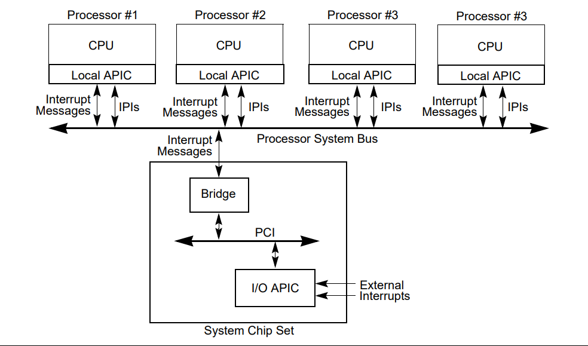

- [中断类型](#中断类型)
- [IDT](#idt)
  - [IDT Gate Descriptor](#idt-gate-descriptor)
- [PIC 可编程中断控制器](#pic-可编程中断控制器)
  - [8259A](#8259a)
  - [APIC](#apic)
    - [Local APIC](#local-apic)
      - [APIC 寄存器](#apic-寄存器)
      - [LVT 本地向量表](#lvt-本地向量表)
      - [IA32 APIC BASE MSR](#ia32-apic-base-msr)
      - [IPI  interprocessor interrupt](#ipi--interprocessor-interrupt)
    - [IOAPIC](#ioapic)
    - [APIC 概览图](#apic-概览图)
- [Trap](#trap)
----
# 中断类型
大多数平台上通常有三类中断：

- 异常(Exceptions)：这些异常由 CPU 内部生成，用于提醒正在运行的内核注意需要注意的事件或情况。在 x86 CPU 上，这些异常包括Double Fault, Page Fault, General Protection Fault等异常情况。
- **中断请求或硬件中断(Interrupt Request (IRQ) or Hardware Interrupt)**：这种类型的中断由芯片组从外部生成，并通过锁存相关 CPU 的 #INTR 引脚或等效信号来发出信号。目前有两种类型的 IRQ 常用。
  - IRQ 线路或基于引脚的 IRQ：这些 IRQ 通常在芯片组上静态路由。线路或线路从芯片组上的设备运行到IRQ 控制器，该控制器将设备发送的中断请求序列化，并将它们逐个发送到 CPU 以防止争用。在许多情况下，IRQ 控制器将根据设备的优先级一次向 CPU 发送多个 IRQ。一个非常著名的 IRQ 控制器示例是Intel 8259(8259A)控制器链，它存在于所有 IBM-PC 兼容芯片组上，将两个控制器链接在一起，每个控制器提供 8 个输入引脚，在旧式 IBM-PC 上总共有 16 个可用的 IRQ 信号引脚。
  - 消息信号中断：这些中断通过将值写入为有关中断设备、中断本身和矢量信息保留的内存位置来发出信号。设备被分配一个位置，它通过固件或内核软件写入该位置。然后，设备使用特定于设备总线的仲裁协议生成 IRQ。提供基于消息的中断功能的总线的一个示例是 PCI 总线。
- 软件中断：这是由 CPU 上运行的软件发出的中断信号，也就是trap。这些类型的中断通常用于系统调用。在 x86 CPU 上，用于启动软件中断的指令是“INT”指令。由于 x86 CPU 可以使用 256 个可用中断向量中的任何一个进行软件中断，因此内核通常会选择一个。例如，许多当代 Unix 在基于 x86 的平台上使用向量 `0x80` 当做系统调用

# IDT
Interrupt Descriptor Table 中断描述符表，是**中断向量(Interrupt Vectors)** 对应的部分，可告知 CPU 中断服务例程(ISR,Interrupt Service Routines) 的位置。

>中断向量编号(Interrupt Vector Number)的允许范围是 0 - 255。0 - 31 范围内的编号由 Intel 64 和 IA-32 架构保留，用于架构定义的异常和中断([《intel系统编程指南》第 3A 卷第 1 部分](https://www.intel.com/content/dam/www/public/us/en/documents/manuals/64-ia-32-architectures-software-developer-vol-3a-part-1-manual.pdf)的第6.15节)。并非每一个被保留的向量编号都有对应的功能，但最好**不要使用它们**。

## IDT Gate Descriptor

IDT一般会包括以下三种门描述符:
- Task-gate descriptor(在x64下已经删除)
- Interrupt-gate descriptor
- Trap-gate descriptor

**x86 IDT Gate Descriptor**

**64位IDT中断/陷阱门描述图**

| 位段      | 描述              |
| --------- | ----------------- |
| 127-96    | Reserved          |
| 95-64     | offset(63-32)      |
| 63-48     | offset(31-16)      |
| 47        | P (Present bit)    |
| 46-45     | DPL (Descriptor Privilege Level) |
| 44        | 0                 |
| 43-40     | Gate Type         |
| 39-35     | Reserved          |
| 34-32     | IST (Interrupt Stack Table) |
| 31-16     | Segment Selector  |
| 15-0      | offset(15-0)       |

- **偏移量(offset)**：一个 64 位值，分为三部分。它表示中断服务程序入口点的地址。
- **段选择器(Segment Selector)**：具有多个字段的段选择器，必须指向 GDT 中的有效代码段。
- **IST**：一个 3 位值，是中断堆栈表的偏移量，存储在任务状态段中。如果所有位都设置为零，则不使用中断堆栈表。
- **门类型(Gate Type)**：一个 4 位值，定义此中断描述符代表的门的类型。在长模式下，有两个有效的类型值：
  - 0b1110 或 0xE：64 位中断门
  - 0b1111 或 0xF：64 位陷阱门
- **DPL**：一个 2 位值，定义允许通过 INT 指令访问此中断的 CPU 特权级别。硬件中断忽略此机制。
- **P**：存在位。必须设置为 (1) 才能使描述符有效。

>中断门与陷阱门唯一的区别在于中段门执行时 EFLAGS 寄存器的**IF（Interrupt Flag）标志**会被清除，这意味着中断发生后，CPU 会临时屏蔽进一步的硬件中断，直到当前中断处理完毕。这样可以防止嵌套中断打断当前中断处理，导致系统混乱。

>x86中断在有无特权级别变化时自动保存到栈上的数据会有所不同具体请翻看[《intel系统编程指南》第 3A 卷第 1 部分](https://www.intel.com/content/dam/www/public/us/en/documents/manuals/64-ia-32-architectures-software-developer-vol-3a-part-1-manual.pdf)的第6.12节。
**注意：当执行 IRET 指令以从异常处理程序返回时，不会弹出错误代码(ERROR CODE)，因此处理程序必须在执行返回之前删除错误代码。**
# PIC 可编程中断控制器
可编程中断控制器 (PIC,Programmable Interrupt Controller) 

## 8259A
历史遗留不做解释

## APIC
过去的`8259A`只能完成单处理器的中断，而无法完成复杂的中断重定向、处理器间中断。因此英特尔针对`8259A`的提出了最新标准: **高级可编程中断控制器 (APIC,Advanced Programmable Interrupt Controller)**。

### Local APIC
**OVERVIEW**
本地高级可编程中断控制器 (Local APIC,Local Advanced Programmable Interrupt Controller)主要在处理器中负责俩个任务:
- 从处理器中断引脚、内部资源、或者外部 I/O APIC（或其他外部中断控制器）接收中断。将这些中断发送到处理器核心进行处理。
- 在多核心系统中，它通过系统总线发送和接受**处理器间中断(IPI, interprocessor interrupt)** 到其他的逻辑处理器。IPI 消息可用于在系统中的处理器之间分配中断或执行系统范围的功能（例如，启动处理器或在一组处理器之间分配工作）。

每个 `Local APIC` 由一组 [APIC 寄存器](#apic-寄存器)和相关硬件组成，用于处理与处理器间中断的传输以及 IPI 消息生成。

`Local APIC` 一般会接收下列几种中断来源：

1. **本地连接的I/O设备 (Locally connected I/O devices)** — 这些中断源自由I/O设备发出的边沿或电平信号，该设备直接连接到处理器的本地中断引脚（LINT0和LINT1）。这些I/O设备也可能连接到一个8259型中断控制器，该控制器通过本地中断引脚之一连接到处理器。
   
2. **外部连接的I/O设备 (Externally connected I/O devices)** — 这些中断源自由I/O设备发出的边沿或电平信号，该设备连接到I/O APIC的中断输入引脚。中断通过I/O APIC作为I/O中断消息发送到系统中的一个或多个处理器。

3. **处理器间中断 (Inter-processor interrupts, IPIs)** — Intel 64或IA-32处理器可以使用IPI机制中断系统总线上另一处理器或一组处理器。IPI用于软件自中断、中断转发或抢占式调度。

4. **APIC定时器生成的中断 (APIC timer generated interrupts)** — 当达到预设计数时，本地APIC定时器可以被编程为向其关联处理器发送本地中断（详见第10.5.4节“APIC定时器”）。

5. **性能监控计数器中断 (Performance monitoring counter interrupts)** — P6系列、Pentium 4和Intel Xeon处理器提供了当性能监控计数器溢出时向其关联处理器发送中断的能力（详见第18.15.5.8节“溢出时生成中断”）。

6. **温度传感器中断 (Thermal Sensor interrupts)** — Pentium 4和Intel Xeon处理器在内部温度传感器触发时可以向自身发送中断（详见第14.7.2节“温度监控”）。

7. **APIC内部错误中断 (APIC internal error interrupts)** — 当本地APIC检测到错误情况时（如尝试访问未实现的寄存器），APIC可以被编程为向其关联处理器发送中断（详见第10.5.3节“错误处理”）。

在接收到来自**本地中断源(local interrupt sources)** 的信号后，Local APIC 会通过中断传送协议将中断传送到处理器核心。而中断传送协议由一组被称为 [本地向量表(LVT, local vector table)](#本地向量表) 的 APIC 寄存器设置。

>本地连接的I/O设备、APIC定时器生成的中断、性能监控计数器中断、温度传感器中断、APIC内部错误中断这些被称作本地中断源(local interrupt sources)

而另外俩种来源的信号(externally connected I/O devices and IPIs),则会通过 IPI 消息处理设施进行处理。

#### APIC 寄存器

APIC 寄存器被内存映射到处理器下 4 KB 物理地址空间，其初始起始地址为 FEE00000H。所有寄存器均以 128 位对齐，无论是32、64 位或 256 位寄存器必须使用多个 32 位加载或存储进行访问，并且所有访问均按 128 位对齐。

| Address      | Register Name                                             | Software Read/Write  |
|--------------|-----------------------------------------------------------|----------------------|
| FEE0 0000H   | Reserved                                                   |                      |
| FEE0 0010H   | Reserved                                                   |                      |
| FEE0 0020H   | Local APIC ID Register                                     | Read/Write           |
| FEE0 0030H   | Local APIC Version Register                                | Read Only            |
| FEE0 0040H   | Reserved                                                   |                      |
| FEE0 0050H   | Reserved                                                   |                      |
| FEE0 0060H   | Reserved                                                   |                      |
| FEE0 0070H   | Reserved                                                   |                      |
| FEE0 0080H   | Task Priority Register (TPR)                               | Read/Write           |
| FEE0 0090H   | Arbitration Priority Register^[Pentium 4 和 Intel Xeon 处理器不支持。写入这些寄存器时，不会设置 ESR 的非法寄存器访问位 (7)。] (APR)                       | Read Only            |
| FEE0 00A0H   | Processor Priority Register (PPR)                          | Read Only            |
| FEE0 00B0H   | EOI Register                                               | Write Only           |
| FEE0 00C0H   | Remote Read Register^[Pentium 4 和 Intel Xeon 处理器不支持。写入这些寄存器时，不会设置 ESR 的非法寄存器访问位 (7)。] (RRD)                                | Read Only            |
| FEE0 00D0H   | Logical Destination Register                               | Read/Write           |
| FEE0 00E0H   | Destination Format Register                                | Read/Write           |
| FEE0 00F0H   | Spurious Interrupt Vector Register                         | Read/Write           |
| FEE0 0100H   | In-Service Register (ISR); bits 31:0                       | Read Only            |
| FEE0 0110H   | In-Service Register (ISR); bits 63:32                      | Read Only            |
| FEE0 0120H   | In-Service Register (ISR); bits 95:64                      | Read Only            |
| FEE0 0130H   | In-Service Register (ISR); bits 127:96                     | Read Only            |
| FEE0 0140H   | In-Service Register (ISR); bits 159:128                    | Read Only            |
| FEE0 0150H   | In-Service Register (ISR); bits 191:160                    | Read Only            |
| FEE0 0160H   | In-Service Register (ISR); bits 223:192                    | Read Only            |
| FEE0 0170H   | In-Service Register (ISR); bits 255:224                    | Read Only            |
| FEE0 0180H   | Trigger Mode Register (TMR); bits 31:0                     | Read Only            |
| FEE0 0190H   | Trigger Mode Register (TMR); bits 63:32                    | Read Only            |
| FEE0 01A0H   | Trigger Mode Register (TMR); bits 95:64                    | Read Only            |
| FEE0 01B0H   | Trigger Mode Register (TMR); bits 127:96                   | Read Only            |
| FEE0 01C0H   | Trigger Mode Register (TMR); bits 159:128                  | Read Only            |
| FEE0 01D0H   | Trigger Mode Register (TMR); bits 191:160                  | Read Only            |
| FEE0 01E0H   | Trigger Mode Register (TMR); bits 223:192                  | Read Only            |
| FEE0 01F0H   | Trigger Mode Register (TMR); bits 255:224                  | Read Only            |
| FEE0 0200H   | Interrupt Request Register (IRR); bits 31:0                | Read Only            |
| FEE0 0210H   | Interrupt Request Register (IRR); bits 63:32               | Read Only            |
| FEE0 0220H   | Interrupt Request Register (IRR); bits 95:64               | Read Only            |
| FEE0 0230H   | Interrupt Request Register (IRR); bits 127:96              | Read Only            |
| FEE0 0240H   | Interrupt Request Register (IRR); bits 159:128             | Read Only            |
| FEE0 0250H   | Interrupt Request Register (IRR); bits 191:160             | Read Only            |
| FEE0 0260H   | Interrupt Request Register (IRR); bits 223:192             | Read Only            |
| FEE0 0270H   | Interrupt Request Register (IRR); bits 255:224             | Read Only            |
| FEE0 0280H   | Error Status Register                                      | Read Only            |
| FEE0 0290H-02E0H   | Reserved                                                   |                      |
| FEE0 02F0H   | LVT CMCI Register                                          | Read/Write           |
| FEE0 0300H   | Interrupt Command Register (ICR); bits 0-31                | Read/Write           |
| FEE0 0310H   | Interrupt Command Register (ICR); bits 32-63               | Read/Write           |
| FEE0 0320H   | LVT Timer Register                                         | Read/Write           |
| FEE0 0330H   | LVT Thermal Sensor Register^[Pentium 4 和 Intel Xeon 处理器引入了该功能。此 APIC 寄存器及其相关功能依赖于实现，可能不会出现在未来的 IA-32 或 Intel 64 处理器中。]                               | Read/Write           |
| FEE0 0340H   | LVT Performance Monitoring Counters Register^[Pentium Pro 处理器引入了该功能。此 APIC 寄存器及其相关功能依赖于实现，可能不会出现在未来的 IA-32 或 Intel 64 处理器中]              | Read/Write           |
| FEE0 0350H   | LVT LINT0 Register                                         | Read/Write           |
| FEE0 0360H   | LVT LINT1 Register                                         | Read/Write           |
| FEE0 0370H   | LVT Error Register                                         | Read/Write           |
| FEE0 0380H   | Initial Count Register (for Timer)                         | Read/Write           |
| FEE0 0390H   | Current Count Register (for Timer)                         | Read Only            |
| FEE0 03A0H   | Reserved                                                   |                      |
| FEE0 03E0H   | Divide Configuration Register (for Timer)                  | Read/Write           |
| FEE0 03F0H   | Reserved                                                   |                      |

**结构图**

#### LVT 本地向量表

- **Delivery Status (Read Only)**
  - **0 (空闲)**: 当前没有来自此中断源的活动，或者来自此中断源的上一个中断已被处理器核心接收。
  - **1 (发送待定)**: 来自此中断源的中断已发送到处理器核心，但尚未被接受（请参见第 10.5.5 节“本地中断接受”）。

- **Interrupt Input Pin Polarity**
  - **0**: 有效电平为高（Active High）
  - **1**: 有效电平为低（Active Low）

- **Remote IRR Flag (Read Only)**
  - 对于固定模式、水平触发中断：当本地 APIC 接受中断进行处理时，此标志被置位；当处理器接收到 EOI 命令时，该标志被清除。对于边沿触发中断和其他发送模式，此标志的意义未定义。

- **Trigger Mode** 
  - **0**: 边沿敏感（Edge Sensitive）
  - **1**: 电平敏感（Level Sensitive）

    此标志仅在发送模式为固定模式时使用。当发送模式为 NMI、SMI 或 INIT 时，触发模式始终为边沿敏感。当发送模式为 ExtINT 时，触发模式始终为电平敏感。计时器和错误中断始终被视为边沿敏感。

    如果本地 APIC 与 I/O APIC 不一起使用且选择了固定发送模式，则 Pentium 4、Intel Xeon 和 P6 系列处理器将始终使用电平敏感触发，无论是否选择了边沿敏感触发。

    软件应始终将 LVT LINT1 寄存器中的触发模式设置为 0（边沿敏感）。LINT1 不支持电平敏感中断。

- **Mask**
  - **0**: 启用中断接收。
  - **1**: 禁止中断接收。

    当本地 APIC 处理性能监控计数器中断时，它会自动将屏蔽标志设置在 LVT 性能计数器寄存器中。此标志在复位时设置为 1，只能通过软件清除。

- **Timer Mode**
  - **00b**: 单次模式，使用倒计时值。
  - **01b**: 周期模式，重新加载倒计时值。
  - **10b**: TSC 截止日期模式，使用 IA32_TSC_DEADLINE MSR 中的绝对目标值。
  - **11b**: 保留

#### IA32 APIC BASE MSR
|             位段                  |          描述         | 
|-----------------------------------|-----------------------|
|  8                                | BSP Flag              | 
|  11                               | APIC Global Enable flag| 
|  12 - 35                          | APIC Base field       | 
|  0 - 7, 9 - 10, MAXPHYADDR1 - 63  | 保留 | 

- **BSP Flag**：指示处理器是否为引导处理器 (BSP)。在电源启动或复位后，BSP 的标志设置为 1，其他处理器 (APs) 设置为 0
- **APIC Global Enable flag**：启用或禁用本地 APIC（高级可编程中断控制器）。此标志在 Pentium 4、Intel Xeon 和 P6 系列处理器中可用，但在未来的 Intel 64 或 IA-32 处理器中可能不可用或位置不同。
- **APIC Base field**：指定 APIC 寄存器的基地址。这个 24 位值通过低端的 12 位扩展形成基地址，自动将地址对齐到 4-KByte 边界。电源启动或复位后，此字段默认设置为 FEE0 0000H。

#### IPI  interprocessor interrupt

### IOAPIC
**OVERVIEW**
外部 I/O APIC 是 Intel 系统芯片组的一部分。其主要功能是接收来自系统及其相关 I/O 设备的外部中断事件，并将它们作为中断消息转发到本地 APIC。在多处理器系统中，I/O APIC 还提供了一种机制，用于将外部中断分发到系统总线上选定处理器或处理器组的Local APIC。

### APIC 概览图
**APIC 概览图(单处理器处理器)**

**APIC 概览图(Xeon下多处理器)**

**APIC 概览图(P6下多处理器)**

# Trap 

